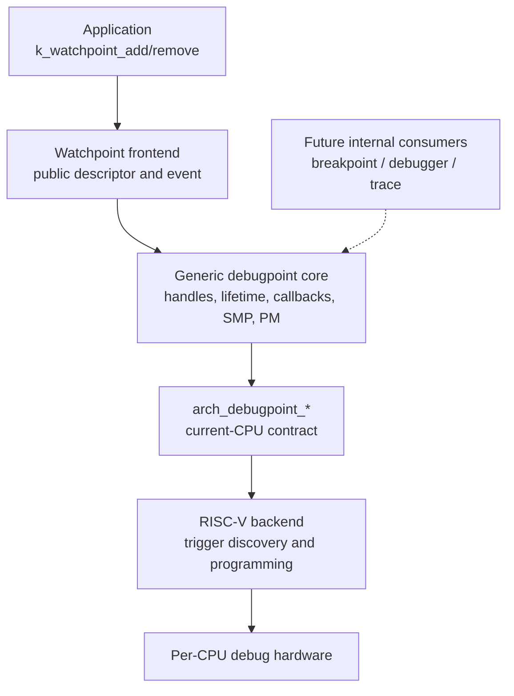
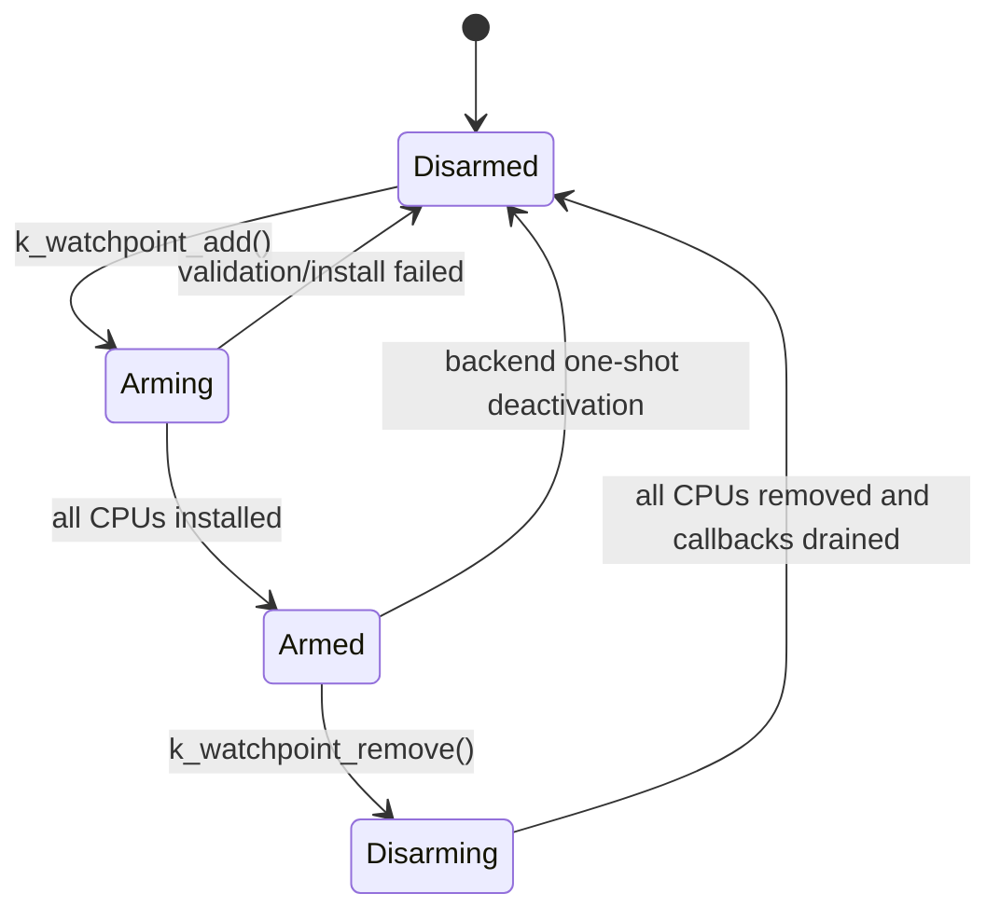
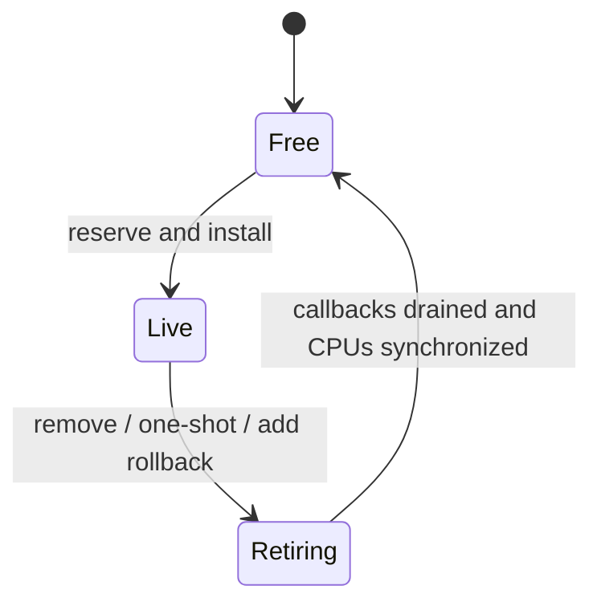
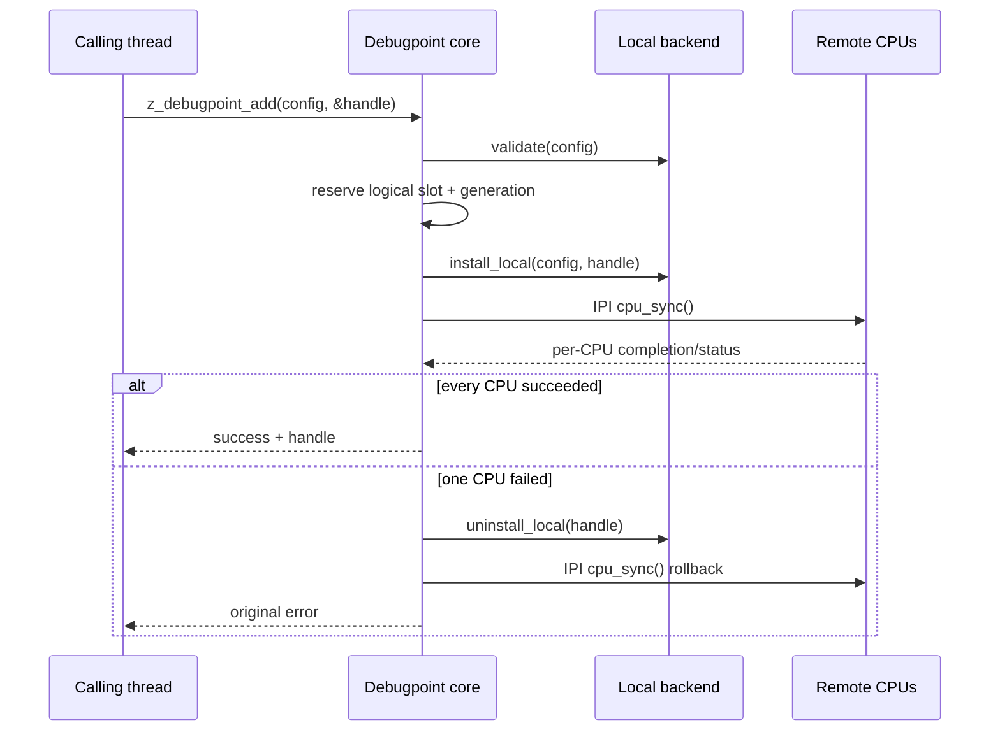
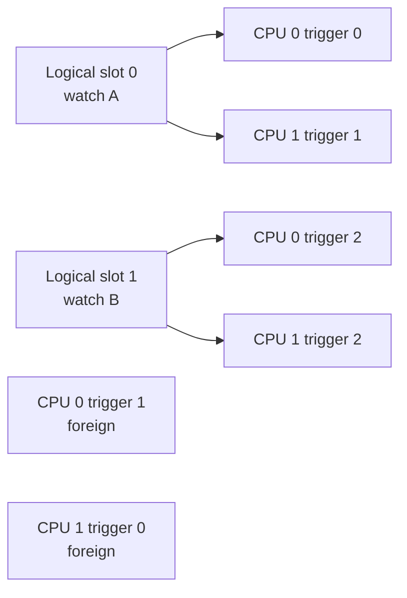
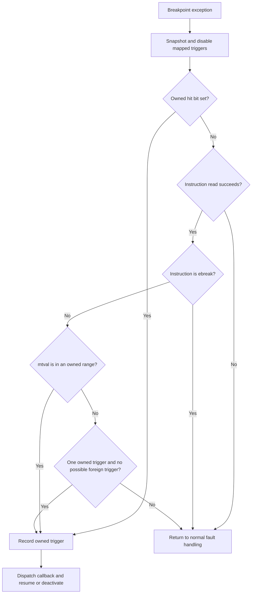

<!--
SPDX-FileCopyrightText: Copyright (c) Qualcomm Technologies, Inc. and/or its subsidiaries.
SPDX-License-Identifier: Apache-2.0
-->

# Hardware Debugpoints and Memory Watchpoints

This document describes Zephyr's generic hardware-debugpoint framework, the
memory-watchpoint API built on it, and the RISC-V trigger backend.

## 1. Overview

Memory corruption is often detected long after the instruction that caused it.
A watchpoint helps answer the more useful question: which instruction first
read or wrote this address?

Many CPUs provide a small set of hardware address comparators. Software gives a
comparator an address, range, and access type. A matching load or store raises a
synchronous exception, allowing Zephyr to report the interrupted context
without instrumenting every memory access.

This subsystem separates two concepts:

- A **debugpoint** is the generic internal description of a hardware debug
  event. Watchpoints and future hardware breakpoints are debugpoint consumers.
- A **watchpoint** is the current public API for observing reads and writes to a
  memory range.

A successfully added watchpoint is installed on every participating CPU. An
access is therefore observed regardless of which CPU performs it.

## 2. Hardware-debug terminology

| Term | Meaning |
| --- | --- |
| Breakpoint | Matches instruction execution, normally by comparing the PC. |
| Watchpoint | Matches a data read, write, or either access type. |
| Comparator | One hardware slot containing an address and match controls. |
| Debug exception | Synchronous exception delivered after a comparator match. |
| Before timing | Exception reported before the memory instruction retires. |
| After timing | Exception reported after the memory instruction retires. |
| Logical slot | Architecture-independent object owned by the generic core. |
| Physical slot | One architecture-specific comparator on one CPU. |
| Self-hosted debug | The target CPU handles its own debug exception. |
| External debug | An external probe controls the target's debug hardware. |

Breakpoints and watchpoints may use the same hardware, but they are different
events. A RISC-V trigger can represent either; another architecture may use
separate register banks. The generic layer records the event type while each
backend owns register allocation and encoding.

## 3. Guarantees and limits

For a successful operation, the implementation guarantees that:

1. The requested range is never silently widened.
2. Add or remove has completed on every participating CPU.
3. A handle is not published until an SMP installation succeeds.
4. A slot pending rollback or cleanup cannot be reused.
5. A stale hardware event cannot reach a reused logical slot.
6. Remove waits for callbacks that already entered.
7. Architecture backends program only the current CPU.
8. Detectably active foreign debug resources are preserved.
9. Required register values are checked after WARL writes.

If SMP installation fails, the generic core starts rollback and keeps the slot
in its retiring state until cleanup succeeds. The caller never receives the
failed handle.

The implementation intentionally does not provide:

- unlimited watchpoints; hardware comparators are scarce;
- representation of every arbitrary byte range;
- a blocking execution environment in the callback;
- transparent multiplexing with an independent debugger or external probe;
- CPU hotplug or delayed SMP boot; `CONFIG_SMP_BOOT_DELAY` is excluded; or
- a stable public debugpoint API. The public API is the watchpoint frontend,
  while debugpoint interfaces remain internal.

## 4. Layered architecture



Each layer has one main responsibility:

| Layer | Responsibility |
| --- | --- |
| Watchpoint frontend | Validate public descriptors and translate events. |
| Debugpoint core | Own logical slots, callbacks, SMP policy, and PM restore. |
| Architecture contract | Describe operations that affect the current CPU. |
| RISC-V backend | Allocate trigger slots and encode RISC-V trigger CSRs. |

SMP synchronization belongs to the generic core. An architecture backend never
sends an IPI or programs another CPU directly. It maintains architecture state
and reconciles the CPU on which it is called.

### 4.1 Public watchpoint frontend

The public API is declared in `include/zephyr/debug/watchpoint.h`:

```c
int k_watchpoint_add(struct k_watchpoint *wp);
int k_watchpoint_remove(struct k_watchpoint *wp);
bool k_watchpoint_is_active(const struct k_watchpoint *wp);
```

`struct k_watchpoint` contains the requested range, access flags, callback, and
user argument. Its `_state` and `_handle` fields are private implementation
state. Zero initialization is valid; `K_WATCHPOINT_INITIALIZER` and
`K_WATCHPOINT_DEFINE` initialize both private fields.

The descriptor and monitored address must remain valid while the point is
active. Public fields may be changed after a successful remove, or after
automatic one-shot deactivation makes `k_watchpoint_is_active()` return false.
Address zero is valid; a zero size is not.

The frontend in `subsys/debug/watchpoint/watchpoint.c` is responsible for:

- validating public flags and descriptor state;
- converting read, write, and read/write requests to internal types;
- serializing concurrent operations on the same descriptor;
- converting internal events to `struct k_watchpoint_event`;
- capturing an optional bounded call stack;
- marking a descriptor inactive after a backend-enforced one-shot hit.

### 4.2 Generic debugpoint core

The internal contract is declared in
`include/zephyr/debug/debugpoint_internal.h`:

```c
int z_debugpoint_add(const struct z_debugpoint_config *config,
		     z_debugpoint_handle_t *handle);
int z_debugpoint_remove(z_debugpoint_handle_t handle);
```

`struct z_debugpoint_config` describes the requested type, range, callback,
and callback data. A successful add returns a nonzero opaque handle. Consumers
retain that handle and use it to remove the same installed instance; they do
not construct or inspect it.

The handle is 64 bits. Its low half encodes the logical slot plus one, which
keeps zero invalid. Its high half is a generation incremented on every
allocation. A stale remove or delayed exception therefore cannot affect a later
user of the same slot.

The core in `subsys/debug/debugpoint/debugpoint.c` owns:

- a fixed table of `CONFIG_DEBUGPOINT_MAX_SLOTS` logical slots;
- opaque generation-tagged handles;
- add/remove serialization with a mutex;
- exception-safe slot state and callback counts under a spinlock;
- synchronous all-CPU reconciliation;
- transactional rollback after partial installation;
- deferred cleanup for backend one-shot events; and
- current-CPU register restoration after power-state exit.

`CONFIG_DEBUGPOINT_MAX_SLOTS` limits logical objects. It does not promise that
the hardware has that many comparators. A backend can return `-ENOSPC` earlier.
On RISC-V it also bounds trigger CSR enumeration and the per-CPU mapping
tables.

### 4.3 Architecture contract

`include/zephyr/arch/debugpoint.h` defines four operations:

| Operation | Contract |
| --- | --- |
| `arch_debugpoint_validate()` | Check representation without changing state. |
| `arch_debugpoint_install_local()` | Create backend state and program this CPU. |
| `arch_debugpoint_uninstall_local()` | Remove the handle from this CPU and backend state. |
| `arch_debugpoint_cpu_sync()` | Reconcile this CPU with backend logical state without sleeping. |

The first install receives the config and core-generated handle and creates
architecture logical state. Other CPUs reproduce that state from
`arch_debugpoint_cpu_sync()`. The local uninstall marks the handle inactive;
subsequent CPU sync calls clear remote copies.

Validation must not change state, and a failed local install must leave no
resource allocated. Repeated uninstall calls must be safe. CPU synchronization
can run with interrupts locked from IPI or PM context and must not sleep.

Backends report exceptions through `z_debugpoint_hit()`. The generation-tagged
handle, rather than a raw comparator number, identifies the logical point. The
core rejects stale generations and exposes backend one-shot deactivation to
frontends as `rearm_required` in the callback event.

## 5. Lifecycle and concurrency

### 5.1 Frontend state



`k_watchpoint_add()` returns `-EBUSY` if the same descriptor is armed or is
being changed. Removing a disarmed descriptor is idempotent.
`k_watchpoint_is_active()` returns true for `ARMING`, `ARMED`, and `DISARMING`;
it returns false only when the descriptor is fully disarmed and can be reused.

### 5.2 Core slot state

The core has three states:

| State | Meaning |
| --- | --- |
| `FREE` | Slot can be allocated. |
| `LIVE` | The slot owns a debugpoint; hits are accepted and callbacks can enter. |
| `RETIRING` | No new hits are accepted; callback drain or hardware cleanup is pending. |



Explicit remove, exception-time one-shot deactivation, and failed-add rollback
use the same retiring cleanup path. Cleanup safely repeats the local uninstall,
drains callbacks, synchronizes every CPU, and only then releases the slot. A
failed cleanup leaves the slot retiring for a later retry.

The frontend and slot states describe different lifetimes. In steady state,
`DISARMED` corresponds to `FREE`, while `ARMED` corresponds to `LIVE`.
For a one-shot hit, the slot enters `RETIRING` before the callback starts, but
the frontend remains `ARMED` until the callback returns. It then becomes
`DISARMED` while deferred slot cleanup finishes.

The logical slot generation increments on every allocation. A delayed hardware
event carrying an old handle is ignored after reuse. Removing a stale handle
with a valid slot encoding is idempotent; a malformed encoding returns
`-EINVAL`.

### 5.3 Transactional add



The add operation does not report success until the remote IPI work has
completed. This is why a write on another CPU can be observed immediately after
`k_watchpoint_add()` returns.

If any CPU fails, the handle is not published. The slot enters the same
`RETIRING` cleanup path used by remove. A cleanup error keeps the slot reserved
so that a later lifecycle operation can retry instead of reusing partial state.

### 5.4 Synchronous SMP update

The core targets every configured CPU. Delayed CPU boot is excluded, so every
target is online and must contain the debugpoint.

The calling CPU runs `arch_debugpoint_cpu_sync()` directly. Other CPUs run it
through immediate IPI work, and the caller waits for every target. The first
nonzero backend result is retained and returned.

Add and remove are rejected from ISR, exception callback, and interrupt-locked
contexts. Waiting for remote IPIs from those contexts could deadlock, and a
synchronous API is more useful to a debugger than an ambiguous asynchronous
result.

Add/remove latency is not a real-time API guarantee. On UP it is dominated by
register probing/programming and readback. On SMP it also includes one IPI round
trip and a backend slot scan on every CPU; rollback can require a second round
trip. A CPU that cannot service IPIs delays the caller. The API is intended for
debug setup and teardown, not a hot path.

### 5.5 Callback lifetime

A hit increments the slot callback count before calling the frontend. Remove
changes the slot state so no new callbacks can enter, then waits until the count
reaches zero. For a one-shot hit, the count remains held through frontend
deactivation. The descriptor and its callback data can therefore be released
after a successful remove or automatic deactivation.

Callbacks execute in synchronous exception context and can run concurrently on
different CPUs. They must be short, bounded, and nonblocking. Safe operations
include atomics and copying event data into preallocated storage.

A callback must not:

- call add or remove;
- sleep or wait for a mutex;
- allocate from a blocking heap; or
- perform unbounded logging.

Architecture handlers suppress this subsystem's owned comparators while the
callback runs when needed. Callback memory accesses are therefore not promised
to trigger other watchpoints.

## 6. Event and call-stack semantics

`struct k_watchpoint_event` reports:

| Field | Meaning |
| --- | --- |
| `pc` | Architecture-reported instruction location. |
| `access_addr` | Hardware-reported data address, only when valid. |
| `access_addr_valid` | Whether `access_addr` may be consumed. |
| `access_size` | Access width, or zero when hardware does not report it. |
| `flags` | Reported or configured read/write type. |
| `timing` | Before, after, or unknown relative to instruction retirement. |
| `rearm_required` | The point becomes inactive after this callback. |
| `callstack` | Callback-lifetime array of captured PCs, or `NULL`. |
| `callstack_depth` | Number of valid entries in `callstack`. |

`access_addr` is optional because not every debug implementation reports a
data address. Consumers must check `access_addr_valid`; the configured range
remains available in the watchpoint descriptor when the exact address is absent.

The first call-stack entry is the event PC when one is available. Further
entries come from `arch_stack_walk()` using the exception frame. Stack walking
is enabled by `CONFIG_WATCHPOINT_CALLSTACK`, requires `ARCH_STACKWALK`, and is
bounded by `CONFIG_WATCHPOINT_CALLSTACK_DEPTH`.

The callback must copy entries it wants to retain. The array is stack storage in
the frontend callback and becomes invalid on return. Frame pointers improve
results. A hit in an ISR can naturally unwind through interrupt frames rather
than looking exactly like a normal thread stack.

The PC has architecture-specific timing:

- A before event normally points at the memory instruction that has not retired.
- An after event can point at the following or a later resume instruction.
- The PC is always suitable for symbolization, but code must inspect `timing`
  before treating it as the exact faulting instruction.

## 7. Power management

Debug registers can lose state when a CPU enters a power state. With
`CONFIG_PM`, the core registers a PM notifier. On state exit, the waking CPU
calls `arch_debugpoint_cpu_sync()` to reconstruct its owned hardware registers
from backend logical state.

The PM callback does not perform an SMP broadcast. It reconciles the register
bank of the CPU executing the notifier. The architecture operation must not
sleep and must be valid with interrupts locked.

## 8. RISC-V trigger backend

The RISC-V implementation is in `arch/riscv/core/debugpoint.c` and
`arch/riscv/core/debugpoint_asm.S`. It supports RV32 and RV64 in M-mode.
`CONFIG_RISCV_S_MODE` is excluded because the trigger CSRs used here are
machine-level CSRs.

### 8.1 Trigger-module model

RISC-V exposes an indexed trigger table. Software writes `tselect` to choose a
slot, then accesses `tdata1` and `tdata2` for that slot. A single physical table
can contain different trigger types, including address/data match, instruction
count, interrupt, exception, and implementation-defined triggers. Each hart has
its own table and can expose a different number of usable slots.

| CSR | Address | Use in this backend |
| --- | --- | --- |
| `tselect` | `0x7a0` | Select a physical trigger slot. |
| `tdata1` | `0x7a1` | Trigger type, access, privilege, match, timing, and hit state. |
| `tdata2` | `0x7a2` | Exact or NAPOT-encoded comparison address. |
| `tinfo` | `0x7a4` | Optional supported-type bitmap and type-version field. |
| `tcontrol` | `0x7a5` | Optional M-mode trigger enable across trap entry. |

The backend supports type 2 `mcontrol` and type 6 `mcontrol6` address/data
triggers. It requests action zero, which raises a breakpoint exception, and
keeps `select` and `chain` clear for one unchained address comparison.
Matching is enabled in M-mode and also U-mode when `CONFIG_USERSPACE` is
enabled. The backend does not use `tdata3`.

### 8.2 Relevant `tdata1` fields

The top four XLEN bits hold the trigger `type`; the adjacent `dmode` bit marks a
slot that only Debug Mode may modify. The common low fields include:

| Field | Purpose |
| --- | --- |
| `load`, `store`, `execute` | Select matching operation types. |
| `u`, `s`, `m` | Select privilege modes. This backend programs M and optional U. |
| `match` | Select exact comparison or NAPOT range comparison. |
| `chain` | Combine with the next trigger. Kept clear here. |
| `action` | Select the event action. Zero requests a breakpoint exception. |
| `select` | Address versus data-value comparison. Kept clear for address match. |
| `timing` | Before or after timing where implemented. |
| `hit` | Sticky or encoded match indication where implemented. |

`mcontrol6` version 0 has a timing bit and one hit bit. Version 1 uses a two-bit
hit encoding: 1 means before, 2 means after or imprecise, and 3 means immediately
after. The version comes from `tinfo.version`; versions newer than those the
backend understands are rejected. Version 1 has no programmable timing bit, so
software learns a trigger's timing only after it fires. The backend reports
that result and treats any event not known to be after as one-shot.

Many fields are WARL: a write can legally read back as another supported value.
The backend reads all required fields back. For `mcontrol` and version 0
`mcontrol6`, it requests after timing but accepts either timing value returned
by hardware. It rejects changes that would alter the address range, access
type, privilege, chaining, action, or data selection.

### 8.3 Safe enumeration

The trigger CSRs are optional. `CONFIG_RISCV_HAS_DEBUG_TRIGGER` must therefore
be provided by ISA metadata, the platform, or an explicit user choice before
the backend is compiled. Blindly probing an absent `tselect` CSR would cause an
illegal-instruction exception on real hardware.

Once the base trigger module is known to exist, slot enumeration follows the
Sdtrig algorithm:

1. Save `tselect`.
2. Write an index and verify that `tselect` reads the same index.
3. Try to read optional `tinfo` through an exception-fixup helper.
4. If `tinfo` exists, `info == 1` means no trigger at that index.
5. If `tinfo` is absent, fall back to `tdata1.type == 0` as the end marker.
6. Scan one index beyond the configured software limit to determine whether
   foreign-trigger enumeration was complete.
7. Restore the original `tselect` value.

The assembly helper converts an illegal `tinfo` access into a normal error
return. A similar fixup helper safely reads the instruction at the exception PC
when distinguishing an explicit `ebreak` from a hardware-trigger exception.

### 8.4 Ownership and foreign triggers

One RISC-V logical slot describes a watchpoint shared by all harts. Each hart
maps it to any compatible physical trigger available locally. Physical indices
do not need to match between CPUs.



The backend state reflects this split:

| State | Purpose |
| --- | --- |
| `g_slots` | System-wide logical slots and verified CSR encodings. |
| `g_slot_count` | Logical capacity derived from the initializing hart. |
| `g_cpu_trigger_count` | Number of physical indices scanned on each hart. |
| `g_cpu_trigger_scan_complete` | Whether scanning found the architectural end. |
| `g_cpu_hw_index` | Per-hart logical-to-physical mapping; `-1` is unmapped. |
| `g_initialized` | Whether one-time discovery and mapping setup completed. |
| `g_lock` | Serialize lifecycle and CPU synchronization in the backend. |

`g_lock` protects installation, removal, and CPU synchronization. The trap
handler deliberately does not take it. Trap context snapshots immutable slot
configuration and uses each slot's atomic `active` flag to coordinate with
lifecycle changes.

The initializing hart's free, compatible triggers determine logical capacity.
Each other hart discovers its own table during CPU synchronization. If any hart
cannot map every active logical slot, generic add fails and starts rollback.

A physical trigger is not claimed if it:

- `dmode` says only an external debugger may modify it;
- contains an enabled trigger not owned by this backend;
- contains a trigger type whose firing behavior is unknown; or
- cannot represent `mcontrol` or `mcontrol6` after CSR readback.

Inactive address-match configurations can be reused. Instruction-count,
interrupt, exception, and custom trigger types are conservatively treated as
foreign even when their enable semantics are unknown.

This preserves detectably active foreign resources, but it is not a complete
debugger-resource multiplexer. An external debugger and this backend must not
independently assume ownership of the same disabled slot.

`g_cpu_trigger_scan_complete` records whether enumeration found the
architectural end before reaching the software limit. If it did not, an unseen
foreign trigger may exist beyond the known table. Exception attribution then
avoids any fallback that requires proving no foreign trigger could have fired.

### 8.5 Range encoding

One RISC-V trigger represents either:

- one exact byte; or
- an aligned, power-of-two NAPOT range.

For a range of `size > 1`, `tdata2` is encoded as:

```text
tdata2 = address | ((size - 1) >> 1)
```

An unaligned or non-power-of-two range returns `-ENOTSUP`. The backend does not
round the request outward because that would report accesses the user did not
ask to monitor. Overlapping logical RISC-V watchpoints are rejected because
some implementations do not provide reliable hit bits or access addresses,
making ownership of one shared exception ambiguous.

### 8.6 Programming sequence

For each selected physical slot the backend:

1. disables load/store/execute matching;
2. writes `tdata2`;
3. writes a disabled `tdata1` configuration;
4. reads back all required configuration and address fields;
5. enables the requested access bits; and
6. reads back again before publishing success.

Disabling before changing the address prevents a transient match against a
half-programmed comparator. `tselect` is saved and restored around every public
operation and exception scan.

### 8.7 Exception attribution and resume

Hardware trigger action 0 reports breakpoint exception cause 3, the same cause
used by an explicit `ebreak`. The backend must establish ownership before it
consumes the exception.



The implementation follows that order:

1. Snapshot each mapped slot's `tdata1` and disable every mapped Zephyr
   trigger.
2. Prefer implemented, nonzero hit fields. More than one owned hit can be
   reported.
3. If no hit bit identifies an owner, read the instruction through exception
   fixup. An unreadable instruction or explicit 16-bit or 32-bit `ebreak` is
   left for normal fault handling.
4. Use `mtval` when it lies in an active owned range.
5. Without a usable address, attribute the exception only when exactly one
   owned trigger was enabled, enumeration was complete, and no foreign trigger
   can fire.
6. Return `-ENOENT` for an ambiguous exception so normal fault handling can
   process it.

`mtval` is not guaranteed to contain a useful data address for every trigger
implementation. The backend sets `access_addr_valid` only when `mtval` falls
inside the selected range. Access size is currently reported as zero.

All Zephyr-owned triggers remain disabled on the current hart while callbacks
run. This prevents callback memory accesses from recursively hitting an owned
point. Other harts retain their mappings and can continue monitoring while the
logical point remains active. One-shot handling retires it globally as
described below.

#### After timing

For after timing, the memory instruction has retired. The backend invokes the
callback, restores active data triggers, and returns from the exception.

#### Before or unknown timing

For a before-timed event, the interrupted memory instruction has not retired.
Returning to the same PC with its data trigger still armed would immediately
trap again. Unknown timing also cannot prove that restoring the trigger is safe.
The RISC-V backend therefore treats both cases as one-shot:

1. Atomically mark the logical slot inactive before invoking the callback.
2. Set `rearm_required` in the reported event.
3. Keep this hart's Zephyr-owned triggers disabled while callbacks run.
4. Return from the exception with the data trigger inactive, allowing an
   unretired access to complete.
5. Schedule generic cleanup to remove the logical point from every CPU.

The watchpoint frontend marks the descriptor inactive as the callback returns.
Application code can add it again from supervisor thread context after
`k_watchpoint_is_active()` reports false. A later lifecycle call completes any
pending hardware cleanup before the slot is reused.

This initial RISC-V implementation uses one-shot handling instead of decoding
the interrupted instruction. Continuous monitoring is guaranteed only for
events that hardware reports with after timing.

### 8.8 `tcontrol` and exception bodies

On implementations with `tcontrol`, trap entry can clear `MTE` while saving it
in `MPTE`. This prevents recursive trigger exceptions in the low-level trap
prologue. If the platform explicitly selects `CONFIG_RISCV_HAS_TCONTROL`, the
backend enables `MTE | MPTE` during initialization and CPU synchronization.
RISC-V trap assembly re-enables `MTE` immediately before interrupt, syscall,
and IRQ-offload bodies.

`tcontrol` itself is optional and cannot be probed safely. The Kconfig option
must only be enabled when the CPU documentation confirms CSR `0x7a5` exists.
Without it, watchpoints still work in normal thread code, but detection inside
exception bodies depends on implementation behavior.

## 9. Coexistence and future consumers

Hardware debug registers are shared resources. This implementation follows two
rules:

1. Do not overwrite a register that is detectably enabled and not owned here.
2. Do not consume an exception when a foreign trigger could explain it.

This is coexistence protection, not a complete resource multiplexer. A future
debugger frontend can use the debugpoint core as another internal consumer
instead of programming the same registers independently. Watchpoints and the
debugger would then share one handle table, generation model, SMP policy, and
exception-dispatch path.

The internal enum already reserves `Z_DEBUGPOINT_BREAKPOINT`. Adding hardware
breakpoints would require:

- a frontend or debugger-facing API;
- per-architecture execute-match validation and register encoding;
- breakpoint-specific resume semantics; and
- shared resource accounting where breakpoint and watchpoint registers overlap,
  as they do in the RISC-V trigger table.

The current implementation does not provide:

- hardware execute breakpoints;
- per-thread or per-CPU public watchpoints;
- CPU hotplug or delayed SMP boot;
- transparent debugger multiplexing;
- event sampling or performance counters; or
- a public generic debugpoint API.

Capabilities, priorities, task-scoped ownership, and a debugger exception chain
can be added to the internal framework without changing the public watchpoint
descriptor. They are not implemented by the current code.

## 10. Return codes and observable behavior

| Result | Typical reason |
| --- | --- |
| `0` | Requested operation completed with its documented SMP semantics. |
| `-EINVAL` | Null callback, zero size, invalid flags, or address overflow. |
| `-EBUSY` | Descriptor transition or backend resource ownership change. |
| `-EWOULDBLOCK` | ISR, callback, or interrupt-locked call context. |
| `-ENOSPC` | No logical slot or suitable physical comparator remains. |
| `-ENOTSUP` | Backend absent, range cannot be encoded, or register readback failed. |

After the base trigger module is known to exist, a request can still fail when
no compatible slot is writable or required WARL fields are unsupported. An
absent RISC-V base trigger CSR is not probe-safe and must be excluded through
`CONFIG_RISCV_HAS_DEBUG_TRIGGER`.

## 11. Configuration map

| Option | Purpose |
| --- | --- |
| `CONFIG_WATCHPOINT` | Enable hardware memory watchpoints. |
| `CONFIG_WATCHPOINT_CALLSTACK` | Capture a bounded stack for each event. |
| `CONFIG_WATCHPOINT_CALLSTACK_DEPTH` | Maximum captured entries. |
| `CONFIG_DEBUGPOINT_MAX_SLOTS` | Generic logical-slot limit, from 1 to 32. |
| `CONFIG_RISCV_HAS_DEBUG_TRIGGER` | Assert that base trigger CSRs exist. |
| `CONFIG_RISCV_HAS_TCONTROL` | Assert that optional `tcontrol` exists. |

`ARCH_HAS_DEBUGPOINT` states that an architecture implements the generic
backend contract. `ARCH_HAS_WATCHPOINT` selects that base capability and states
that the backend supports memory watchpoints. On SMP systems the architecture
must also support scheduler IPIs so that the generic core can update each CPU
synchronously.

## 12. Test coverage

`tests/debug/watchpoint` covers the public contract and backend edge cases on
RV32 and RV64. The matrix includes uniprocessor, SMP, and userspace variants.

Major scenarios include:

- read, write, and read/write events;
- access completion and reported timing versus callback memory state;
- byte ranges, exact range behavior, and cross-granule ranges;
- zero initialization, invalid flags, zero size, address overflow, and address
  zero;
- idempotent remove, descriptor reuse, and double add;
- multiple points, resource exhaustion, and resource reuse;
- callback recursion suppression and callback-context rejection;
- ISR hits and API rejection from ISR/interrupt-locked contexts;
- userspace access and saved call-stack output;
- remote-CPU hits and add/remove initiated on another CPU;
- concurrent SMP add serialization;
- RISC-V unsupported range and overlap rejection;
- explicit RISC-V `ebreak` preservation;
- timing-dependent one-shot deactivation, suppression after deactivation, and
  explicit re-arming;
- RISC-V per-hart remapping around a foreign trigger; and
- remove waiting for an in-progress callback on another CPU.

QEMU validates behavior for the emulated CPUs. Physical execution is still
required to validate a particular core's optional trigger implementation, WARL
behavior, firmware permissions, and power-domain retention.

## 13. Reference

- [RISC-V Debug Specification, Sdtrig](https://docs.riscv.org/reference/debug/v1.0/Sdtrig.html)
